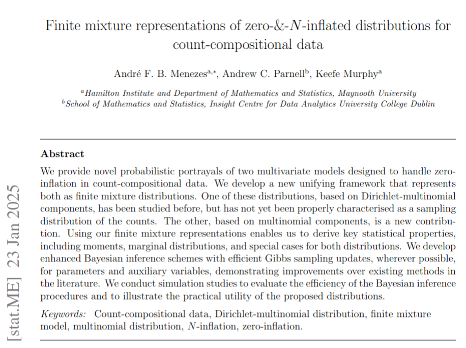

```{r setup, include=FALSE}
knitr::opts_chunk$set(echo = FALSE, fig.align = "center",
                      dev = "svg", fig.width = 10, fig.height = 6)
library(RefManageR)
library(ggplot2)
library(cowplot)
library(xtable)
theme_set(
  theme_cowplot(font_size = 16, font_family = "Palatino") +
    background_grid() +
    theme(legend.position = "top")
)
options(digits = 4L)

BibOptions(check.entries = FALSE, bib.style = "authoryear", style = "markdown",
           hyperlink = TRUE, dashed = TRUE, max.names = 1, longnamesfirst = FALSE)
bib <- ReadBib("./references.bib", check = FALSE)
data_pollen <- read.csv(file = file.path("./data", "rs11_pollen.csv"))
data_pollen <- dplyr::as_tibble(data_pollen)
sp <- c("Pinus.D", "Betula", "Gramineae", "Picea", "Quercus.D", "Alnus", "Cyperaceae",
        "Chenopodiaceae", "Artemisia", "Quercus.E", "Salix", "Juniperus", "Ericales",
        "Fagus", "Abies", "Olea", "Ulmus", "Corylus", "Ostrya", "Pinus.H", "Cedrus",
        "Carpinus", "Pistacia", "Castanea", "Larix", "Tilia", "Ephedra", "Phillyrea")
data_pollen$specie <- forcats::fct_relevel(data_pollen$specie, sp)
```

# Outline

- Motivating example

- Zero-&-N-inflated count-compositional distributions

- Extending with non-parametric regression

- Final remarks

---
## Motivating example

- Paleoclimate modelling (pollen counts): `r Citet(bib, c("Haslett2006", "SalterTownshend2012", "Parnell2015", "Ilvonen2016", "Tipton2019"))`: 3 covariates and $d=28$ categories.

```{r glimpse}
data_pollen |>
  # dplyr::filter(id < 4) |>
  dplyr::select(-c(category, prop)) |>
  dplyr::mutate(total = as.integer(total)) |> 
  tidyr::pivot_wider(names_from = specie, values_from = total) |> 
  dplyr::select(gdd5, mtco, aet.pet, dplyr::all_of(sp))
#    |>
#   dplyr::glimpse()
```

---
## Motivating example

<!-- - Experiment induced a compositional structure, and the observed data has many zeros. -->

```{r plot-pollen, echo = FALSE, out.width="80%"}
data_pollen |> 
  dplyr::filter(specie %in% sp[1:9]) |>
  ggplot(aes(x = mtco, y = prop)) +
  facet_wrap(~specie) +
  geom_point(alpha = 0.5, size = 0.8) +
  geom_rug(data = dplyr::filter(data_pollen, specie %in% sp[1:9], total == 0),
           aes(y = NA_real_), col = "red") +
  labs(y = "Empirical proportion", x = "Mean temperature of coldest month (MTCO)")
```

- No zero-inflated versions of multinomial or Dirichlet-multinomial distributions
available.


---
# zero-&-N-inflated count-compositional distributions

- Let $\mathbf{Y} = (Y_{1}, \ldots, Y_{d})$ be a count-compositional random vector,
whose sum $\sum_{j=1}^{d} Y_j = N$ is constrained by a (known) integer $N$.

--
- Let $\boldsymbol{\zeta} = (\zeta_1, \ldots, \zeta_d)$ be a vector of zero-inflation parameters for each category such that $\zeta_j \in \lbrack 0, 1 \rbrack$,
for $j=1,\ldots,d$.

--
- Zero-&-N-inflated Multinomial (ZANIM): $\mathbf{Y} \sim \operatorname{ZANIM}_d\lbrack N,\boldsymbol{\theta}, \boldsymbol{\zeta}\rbrack$, where $\boldsymbol{\theta} = (\theta_1, \ldots, \theta_d)$, such that $\theta_j \geq 0$ and $\sum_{j=1}^d\,\theta_j=1$, denotes the probability of occurrence of category $j$.

--
- Zero-&-N-inflated Dirichlet-Multinomial (ZANIDM): $\mathbf{Y} \sim \operatorname{ZANIDM}_d\lbrack N,\boldsymbol{\alpha}, \boldsymbol{\zeta}\rbrack$, where $\boldsymbol{\alpha} = (\alpha_1, \ldots, \alpha_d)$, such that $\alpha_j > 0$ are concentration parameters.

---
# Finite mixture representation


- We develop a new unifying framework that represents both as finite mixture distributions,
_with $2^d$ components_.

- We can write their probability mass function (p.m.f.) as:

$$p(\mathbf{y}; \boldsymbol{\vartheta}, \boldsymbol{\zeta}) = \sum_{\ell=1}^{2^d} \eta_\ell\,p_\ell(y; \boldsymbol{\vartheta}_\ell)$$
where $\pmb{\vartheta}$ refers to $\pmb{\theta}$ or $\pmb{\alpha}$ under
ZANIM and ZANIDM, respectively

--

- _However_, both distributions have only $2d$ parameters: $\boldsymbol{\theta}$ or $\boldsymbol{\alpha}$, 
and $\boldsymbol{\zeta}$.


--

- _And_ the mixture weights $(\eta_\ell)$ are functions of $\pmb{\zeta}$:
.font80[
.pull-left[
- $\eta_d = \prod_{j=1}^d\,(1-\zeta_j)$ 
- $\eta_0 = \prod_{j=1}^d\,\zeta_j$
]
.pull-right[
- $\eta_N^{(j)} = (1 - \zeta_{j})\,\prod_{k \colon k \neq j} \zeta_{k}$, for $j = 1\ldots, d$.
- Define 
$\mathfrak{K} = \{\mathcal{K} \subseteq \{1,\ldots,d\}; 1 \leq \lvert\mathcal{K}\rvert \leq d-2\}$,
then for each $\mathcal{K} \in \mathfrak{K}$, we have
$\eta_{\mathcal{K}} = \prod_{k \in \mathcal{K}} \zeta_k\,\prod_{j \notin \mathcal{K}} (1 - \zeta_j)$.
]

]

---
# ZANIM's p.m.f.

$$\begin{align}\Pr\lbrack 
\mathbf{Y} = \mathbf{y}; \pmb{\theta}, \pmb{\zeta}\rbrack &= \eta_d\,\binom{N}{y_{1} \dots y_{d}}\, 
\prod_{j=1}^d
\theta_j^{y_{j}} \\
&\phantom{=}~+\eta_0\,\prod_{j=1}^{d}\,I_0(y_j)\\
&\phantom{=}~+
\sum_{j=1}^{d}\,
\eta_{N}^{(j)}
\left\lbrack 
I_0\left(\sum_{k\colon k \neq j} y_{k} \right)\,
\right\rbrack \\
&\phantom{=}~+
\sum_{\mathcal{K} \in \mathfrak{K}} 
\eta_{\mathcal{K}}
\left\lbrack
I_0\left(\sum_{k \in \mathcal{K}} y_k\right) 
\binom{N}{\{y_j\}_{j \notin \mathcal{K}}} 
\prod_{j \notin \mathcal{K}} \left( \theta_j^{\mathcal{K}} \right)^{y_j}
\right\rbrack  
\quad \mathrm{for} \quad \mathbf{y} \in \pmb{\Omega}_{d,N},\end{align}$$
where 
$\theta_j^{\mathcal{K}} = \dfrac{\theta_j}{1 - \sum_{\ell \in \mathcal{K}}\,\theta_{\ell}}$.

> We do not need to evaluate ALL $2^d$ mixture components.

---
### Marginal p.m.f. $\pmb{\theta} = (0.05, 0.70, 0.25), \pmb{\zeta} = (0.05, 0.15, 0.10)$ and $N=30$

```{r marginal-pmf,fig.width = 12, fig.height = 4}
.dbetabinomial <- function(x, n, a, b, log = TRUE) {
  out <- lchoose(n, x) + lbeta(x + a, n - x + b) - lbeta(a, b)
  if (log) return(out) else return(exp(out))
}

d <- 3L
m <- 30L
theta <- c(0.05, 0.70, 0.25)
alpha <- 20*theta
zeta <- c(0.10, 0.15, 0.05)

xx <- seq.int(0, m)
pmf_zanim <- matrix(data = 0L, nrow = length(xx), ncol = d)
pmf_zanidm <- matrix(data = 0L, nrow = length(xx), ncol = d)
pmf_mult <- matrix(data = 0L, nrow = length(xx), ncol = d)
pmf_dm <- matrix(data = 0L, nrow = length(xx), ncol = d)

for (i in seq_along(xx)) {
  pmf_zanim[i, 1L] <- zanim::dzanim_marginal(x = xx[i], size = m, prob = theta, 
                                      zeta = zeta, j = 1L)
  pmf_zanim[i, 2L] <- zanim::dzanim_marginal(x = xx[i], size = m, prob = theta,
                                      zeta = zeta, j = 2L)
  pmf_zanim[i, 3L] <- zanim::dzanim_marginal(x = xx[i], size = m, prob = theta,
                                      zeta = zeta, j = 3L)
  pmf_zanidm[i, 1L] <- zanim::dzanidm_marginal(x = xx[i], size = m, alpha = alpha,
                                        zeta = zeta, j = 1L)
  pmf_zanidm[i, 2L] <- zanim::dzanidm_marginal(x = xx[i], size = m, alpha = alpha,
                                        zeta = zeta, j = 2L)
  pmf_zanidm[i, 3L] <- zanim::dzanidm_marginal(x = xx[i], size = m, alpha = alpha,
                                        zeta = zeta, j = 3L)
}
pmf_mult[, 1L] <- dbinom(x = xx, size = m, prob = theta[1L])
pmf_mult[, 2L] <- dbinom(x = xx, size = m, prob = theta[2L])
pmf_mult[, 3L] <- dbinom(x = xx, size = m, prob = theta[3L])


pmf_dm[, 1L] <- .dbetabinomial(x = xx, n = m, a = alpha[1L], b = sum(alpha[-1L]),
                               log = FALSE)
pmf_dm[, 2L] <- .dbetabinomial(x = xx, n = m, a = alpha[2L], b = sum(alpha[-2L]),
                               log = FALSE)
pmf_dm[, 3L] <- .dbetabinomial(x = xx, n = m, a = alpha[3L], b = sum(alpha[-3L]),
                               log = FALSE)


data_pmf_zanim <- dplyr::tibble(dist = "ZANIM",
                                x = rep(xx, d),
                                pmf = c(pmf_zanim),
                                cat = rep(paste0("j == ", 1:d),
                                          each = length(xx)))
data_pmf_zanidm <- dplyr::tibble(dist = "ZANIDM",
                                 x = rep(xx, d),
                                 pmf = c(pmf_zanidm),
                                 cat = rep(paste0("j == ", 1:d),
                                           each = length(xx)))
data_pmf_mult <- dplyr::tibble(dist = "Multinomial",
                               x = rep(xx, d),
                               pmf = c(pmf_mult),
                               cat = rep(paste0("j == ", 1:d),
                                         each = length(xx)))
data_pmf_dm <- dplyr::tibble(dist = "DM",
                               x = rep(xx, d),
                               pmf = c(pmf_dm),
                               cat = rep(paste0("j == ", 1:d),
                                         each = length(xx)))
data_pmf <- rbind(data_pmf_zanim, data_pmf_zanidm, data_pmf_mult,
                  data_pmf_dm)

mom <- lapply(1:d, function(j) {
  out <- rbind(
    do.call(cbind, zanim::moments_zanim(size = m, prob = theta, zeta = zeta, j = j)),
    do.call(cbind, zanim::moments_zanidm(size = m, alpha = alpha, zeta = zeta, j = j))
  )
  cbind(dist = c("ZANIM", "ZANIDM"), j = j, 
        prob0 = c(zanim::dzanim_marginal(x = 0, size = m, prob = theta,
                                  zeta = zeta, log = TRUE, j = j),
                  zanim::dzanidm_marginal(x = 0, size = m, alpha = alpha,
                                   zeta = zeta, log = TRUE, j = j)),
        data.frame(out))
})
teo_moments_mult <- data.frame(dist = c("Multinomial"),
                               j = 1:3,
                               prob0 = dbinom(x = 0, size = m, prob = theta, log = TRUE),
                               mean = m*theta,
                               var = m*theta*(1 - theta))
# teo_moments_dm <- data.frame(
#   dist = c("DM"), j = 1:3,
#   prob0 = c(.dbetabinomial(x = 0, n = m, a = alpha[1L], b = sum(alpha[-1L]), log = FALSE),
#             .dbetabinomial(x = 0, n = m, a = alpha[2L], b = sum(alpha[-2L]), log = FALSE),
#             .dbetabinomial(x = 0, n = m, a = alpha[3L], b = sum(alpha[-3L]), log = FALSE)),
#   mean = m*c(theta),
#   var = m*theta*(1 - theta))
teo_moments <- do.call(rbind, mom)
teo_moments <- rbind(teo_moments, teo_moments_mult)
teo_moments$di <- teo_moments$var / teo_moments$mean
teo_moments$zi <- 1 + teo_moments$prob0 / teo_moments$mean
teo_moments$cat <- paste0("j == ", teo_moments$j)


ggplot(data = dplyr::filter(data_pmf, dist %in% c("ZANIM", "Multinomial")),
            aes(x = x, y = pmf, col = dist)) +
  facet_wrap(~cat, nrow = 1L, scales = "free", labeller = label_parsed) +
  geom_pointrange(mapping = aes(ymin = 0, ymax = pmf),
                  size = 0.12, fill = 0.2) +
  scale_x_continuous(breaks = scales::pretty_breaks(8)) +
  labs(x = "k", y = latex2exp::TeX(r'($\Pr\lbrack Y_j = k \rbrack$)'),
       col = "") +
  colorspace::scale_color_discrete_qualitative()
```

--

```{r tab-moments}
tab <- teo_moments |> 
  dplyr::filter(dist != "ZANIDM") |> 
  dplyr::arrange(j) |> 
  dplyr::select(-c(prob0, cat))
colnames(tab) <- c(
  "Distribution", "j", "$\\mathbb{E}\\lbrack Y_j\\rbrack$",
  "$\\mathrm{Var}\\lbrack Y_j \\rbrack$", "$\\mathrm{DI}\\lbrack Y_j \\rbrack$",
  "$\\mathrm{ZI}\\lbrack Y_j \\rbrack$")
tab |> 
  kableExtra::kbl(caption = "Theoretical moments.", digits = 3, escape = FALSE) |> 
  kableExtra::kable_classic(full_width = FALSE, html_font = "Palatino",
                            font_size = 14)
```

---
# Sthocastic representation

If $\mathbf{Y} \sim \operatorname{ZANIM}_d\lbrack N, \boldsymbol{\theta}, \boldsymbol{\zeta} \rbrack$,
then $\mathbf{Y}$ has the stochastic representation:
$$\begin{align*}
(z_j \mid \zeta_{j}) &\sim \operatorname{Bernoulli}\lbrack 1 - \zeta_j \rbrack, \quad j=1,\ldots, d\\
(\mathbf{Y} \mid N, \boldsymbol{\theta}, \boldsymbol{z}) &\sim
\begin{cases} \delta_{\mathbf{0}_d}(\cdot) & \textrm{if} \: z_{j} = 0 \: \forall j\\
\operatorname{Multinomial}_d\left\lbrack N, z_1\dfrac{\theta_1}{1 - s}, \ldots, z_d\dfrac{\theta_d}{1 - s}\right\rbrack
& \textrm{otherwise},
\end{cases}
\end{align*}$$
where $s=\sum_{k=1}^d (1 - z_k)\theta_k$.


--
If $\mathbf{Y} \sim \operatorname{ZANIDM}_d\lbrack N, \boldsymbol{\alpha}, \boldsymbol{\zeta} \rbrack$,
then $\mathbf{Y}$ has the stochastic representation `r Citep(bib, "Koslovsky2023")`:
$$\begin{align*}
(z_{j} \mid \zeta_{j}) & \sim \operatorname{Bernoulli}\lbrack 1 - \zeta_{j}\rbrack, \\
(\lambda_{j} \mid z_{j}, \alpha_{j}) &\sim (1 - z_{j})\,\delta_0(\cdot) + z_{j} \operatorname{Gamma}\lbrack \alpha_{j}, 1\rbrack, \quad j = 1,\ldots, d, \\
(\mathbf{Y} \mid N, \boldsymbol{\lambda}, \boldsymbol{z}) &\sim
\begin{cases} \delta_{\mathbf{0}_d}(\cdot) & \textrm{if} \: z_{j} = 0 \: \forall j\\
\operatorname{Multinomial}_d\left\lbrack N, \frac{\lambda_{1}}{\sum_{\ell=1}^{d}\,\lambda_{\ell}}, \ldots, \frac{\lambda_{d}}{\sum_{\ell=1}^{d}\,\lambda_{\ell}}\right\rbrack
& \textrm{otherwise},
\end{cases}\end{align*}$$


---
# Menezes, Parnell, and Murphy (2025)

.pull-left[
```{r}

```
]
.pull-right[
```{r}

```
]


---
# Extending ZANIM with non-parametric regression

- We allow both sets of parameters $\boldsymbol{\theta}$ and $\boldsymbol{\zeta}$
to depend on covariates through a non-parametric sum of decision trees.

--

- Given a vector of observed covariates, $\mathbf{x}_i$, we assume that the random
vector $\mathbf{Y}_{i}$ is

$$\begin{align}(\mathbf{Y}_{i} \mid \mathbf{x}_i, \mathcal{T}^{\pmb{\theta}}, \mathcal{M}^{\pmb{\theta}},
\mathcal{T}^{\pmb{\zeta}}, \mathcal{M}^{\pmb{\zeta}}) &
\sim \operatorname{ZANIM}\lbrack N_i; \pmb{\theta}_i, \pmb{\zeta}_i\rbrack\\
h_1(\theta_{ij}) &=
\sum_{t=1}^{m_{\pmb{\theta}}} g(\mathbf{x}_i; \mathcal{T}^{(\theta_j)}_{t}, \mathcal{M}^{(\theta_j)}_{t}), \quad j = 1,\ldots, d,\\
h_2(\zeta_{ij}) &= 
\sum_{t=1}^{m_{\pmb{\zeta}}} g(\mathbf{x}_i; \mathcal{T}^{(\zeta_j)}_{t}, \mathcal{M}^{(\zeta_j)}_{t}),
\quad j = 1,\ldots, d.\end{align}$$

where $h_1(\cdot)$ and $h_2(\cdot)$ are suitable link functions,
$g(\mathbf{x}_i; \mathcal{T}, \mathcal{M}) = I(\mathbf{x}_i \in \mathcal{A}_{\ell})\,\mu_{\ell}$
with $\mu_{\ell} \in \mathbb{R}$ for $\ell = 1\ldots, b$ terminal nodes of $\mathcal{T}$,
and $\{A_{\ell}\}_{\ell=1}^b$ is a partition of the covariate space $\mathcal{X}$.

- Bayesian inference is performed through MCMC algorithm
`r Citep(bib, c("Chipman2010", "Linero2020", "Murray2021"))`.

---
# Preliminary results


```{r ploting}
d_theta <- readRDS("./data/df_theta.rds")
d_zeta <- readRDS("./data/df_zeta.rds")
data_pollen <- read.csv("./data/rs11_pollen.csv")
chosen_species <- c("Pinus.D", "Artemisia")
# Filtering
d_theta <- dplyr::filter(d_theta, specie %in% chosen_species)
d_zeta <- dplyr::filter(d_zeta, specie %in% chosen_species)
data_pollen <- dplyr::filter(data_pollen, specie %in% chosen_species) |> 
  dplyr::mutate(is_zero = total == 0)
# Plotting
list_plots <- vector(mode = "list", length = length(chosen_species))
for (j in seq_along(chosen_species)) {
  data_curr <- dplyr::filter(data_pollen, specie == chosen_species[j])
  data_curr_zeta <- dplyr::filter(d_zeta, category == data_curr$category[j])
  data_curr_theta <- dplyr::filter(d_theta, category == data_curr$category[j])
  p_theta <- ggplot(data_curr, aes(x = mtco)) +
    geom_point(aes(y = prop), alpha = 0.5, size = 0.5) +
    geom_rug(data = dplyr::filter(data_curr, is_zero),
             aes(y = NA_real_), col = "red", alpha = 0.3) +
    geom_line(data = data_curr_theta, aes(y = mean), col = "dodgerblue") +
    geom_ribbon(data = data_curr_theta, aes(ymin = ci_lower, ymax = ci_upper),
                fill = "dodgerblue", alpha = 0.3) +
    scale_y_continuous(breaks = scales::pretty_breaks(6), limits = c(0, 1)) +
    scale_x_continuous(breaks = scales::pretty_breaks(10)) +
    labs(x = "MTCO", y = "Empirical proportion")
  p_zeta <- ggplot(data_curr_zeta, aes(x = mtco, y = mean)) +
    geom_rug(data = data_curr, aes(y = NA_real_, col = is_zero), alpha = 0.3,
             show.legend = FALSE) +
    geom_line(col = "dodgerblue") +
    geom_ribbon(aes(ymin = ci_lower, ymax = ci_upper), fill = "dodgerblue",
                alpha = 0.3) +
    scale_color_manual(values = c("black", "red")) +
    scale_x_continuous(breaks = scales::pretty_breaks(10)) +
    scale_y_continuous(breaks = scales::pretty_breaks(6), limits = c(0, 1)) +
    labs(x = "MTCO", y = expression(zeta[ij]), col = "")
  p_row <- plot_grid(p_theta, p_zeta)
  title <- ggdraw() +
    draw_label(chosen_species[j], fontface = 'bold', x = 0.05, hjust = 0) +
    theme(plot.margin = margin(0, 0, 0, 2))
  list_plots[[j]] <- plot_grid(title, p_row, ncol = 1, rel_heights = c(0.05, 1))
}
plot_grid(plotlist = list_plots, ncol = 1)
```


---
# Final remarks

- We introduced and characterised two parametric families of distributions to model
zero-inflation in count-compositional data through a mixture approach.

- We incorporated covariates in ZANIM's parameters through a non-parametric
additive regression trees approach.

--

- Extend ZANIDM to allowed parameters dependent on covariates through non-parametric additive
regression trees.

- Consider other component distributions suitable for modelling count-compositional
data, e.g., the Conway-Maxwell-multinomial distribution `r Cite(bib, c("Kadane2018", "Morris2020"))`.

- Study theoretical aspects of identifiability.

---
# References

.font80[
```{r bib, results='asis', echo=FALSE}
RefManageR::PrintBibliography(bib, start = 1, end = 9)
```
]


---
class: center, middle

# Thank you!

.pull-left[.pull-down[
<a href="mailto:andrefelipemaringa@gmail.com">
`r icons::fontawesome("paper-plane")` andrefelipemaringa@gmail.com
</a>

<a href="http://github.com/AndrMenezes">
`r icons::fontawesome("github")` @AndrMenezes
</a>

<br><br><br><br><br>
]]

.pull-right[
```{r qrcode-2}

```
]
